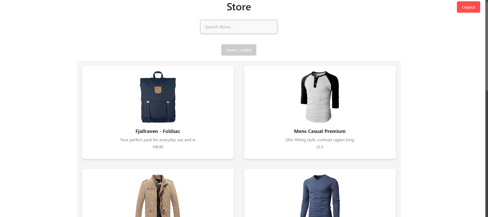
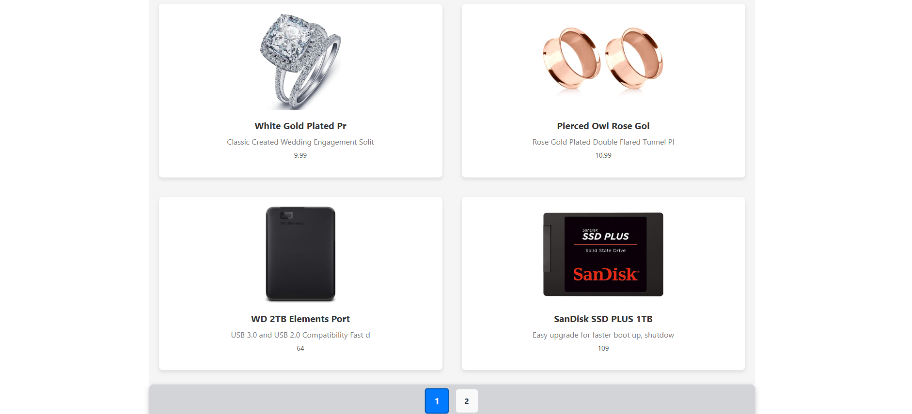
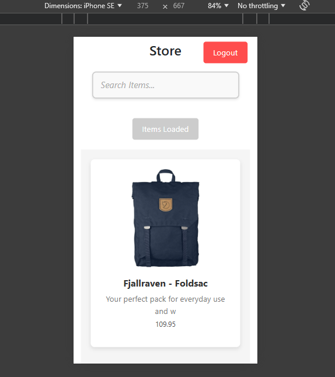

This template provides a minimal setup to get React working in Vite with HMR and some ESLint rules.

Currently, two official plugins are available:

- [@vitejs/plugin-react](https://github.com/vitejs/vite-plugin-react/blob/main/packages/plugin-react/README.md) uses [Babel](https://babeljs.io/) for Fast Refresh
- [@vitejs/plugin-react-swc](https://github.com/vitejs/vite-plugin-react-swc) uses [SWC](https://swc.rs/) for Fast Refresh

SAV.COM ASSIGNMENT

Deployed Link :  https://serene-taiyaki-cd29e2.netlify.app/

(Note : The API is slow wait on the Homepage for 5-10 seconds, Thank you)

ScreenShots : 

*** Description***

The Products Management Application is a React-based web application that provides functionality to:

The project demonstrates core React concepts and provides an intuitive user interface styled with CSS.

## Features

- **Search Functionality**: Real-time search to filter products by title.
- **Pagination**: Navigate through product pages using "Previous," "Next, " and page numbers.
- **Drag-and-Drop**: Rearrange product positions interactively .
- **Interactive Product Cards**: Display product details.
