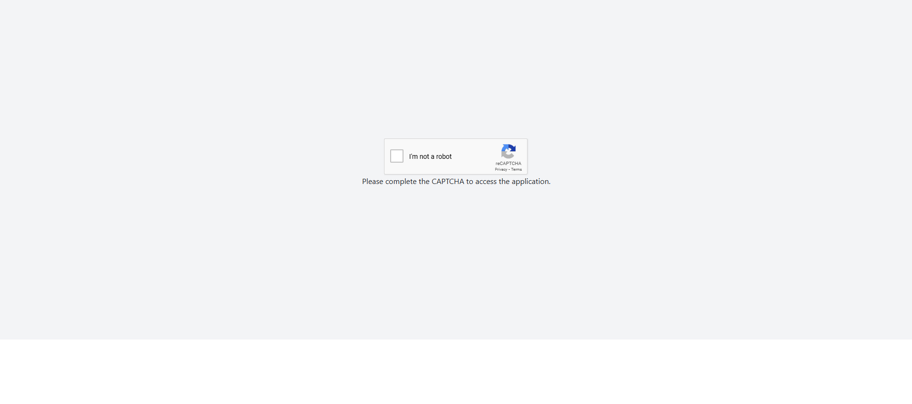

# STORE

## A modern e-commerce store application built using React and Vite, designed for seamless user experience. The app includes features such as real-time search, pagination, drag-and-drop functionality, and product cards.

## Features

- **Search Functionality**: Real-time search to filter products by title.
- **Pagination**: Navigate through product pages using page numbers.
- **Drag-and-Drop**: Rearrange product positions interactively.
- **Interactive Product Cards**: Display detailed product information.

## Deployment

The application is deployed on Netlify. You can access it using the following link:

[Live Demo](https://serene-taiyaki-cd29e2.netlify.app/)

> **Note**: The API might be slow; please wait 5-10 seconds on the homepage for the products to load.

## Tech Stack

- **Frontend**: React, Tailwind CSS
- **Build Tool**: Vite
- **Deployment**: Netlify

ScreenShots : 




## Directory Structure

```
└── imrayn06-Store/
    ├── README.md
    └── Store/
        ├── README.md
        ├── eslint.config.js
        ├── index.html
        ├── package-lock.json
        ├── package.json
        ├── tailwind.config.js
        ├── vite.config.js
        ├── .gitignore
        └── src/
            ├── App.css
            ├── App.jsx
            ├── index.css
            ├── main.jsx
            └── components/
                ├── Item.jsx
                ├── ItemList.jsx
                ├── NavBar.jsx
                ├── Pagination.jsx
                └── SearchInput.jsx
```

## Installation and Setup

1. Clone the repository:
   ```bash
   git clone https://github.com/imrayn06-Store.git
   ```

2. Navigate to the project directory:
   ```bash
   cd imrayn06-Store/Store
   ```

3. Install dependencies:
   ```bash
   npm install
   ```

4. Start the development server:
   ```bash
   npm run dev
   ```

5. Open the app in your browser at `http://localhost:3000` (or the specified port).

## How to Use

1. **Search**: Use the search bar to filter products by title.
2. **Pagination**: Navigate through product pages using the page numbers at the bottom.
3. **Drag-and-Drop**: Rearrange product positions by dragging and dropping.
4. **Interactive Cards**: Click on a product card to view its details.

## Project Configuration

- **Vite**: For fast and efficient development.
- **Tailwind CSS**: For utility-first styling.
- **ESLint**: To ensure code quality and consistency.

## Contributing

Contributions are welcome! Please follow these steps:

1. Fork the repository.
2. Create a new branch for your feature:
   ```bash
   git checkout -b feature-name
   ```
3. Commit your changes:
   ```bash
   git commit -m "Add your message here"
   ```
4. Push to your branch:
   ```bash
   git push origin feature-name
   ```
5. Open a pull request on GitHub.

---

Thank you for checking out the imrayn06-Store project!
